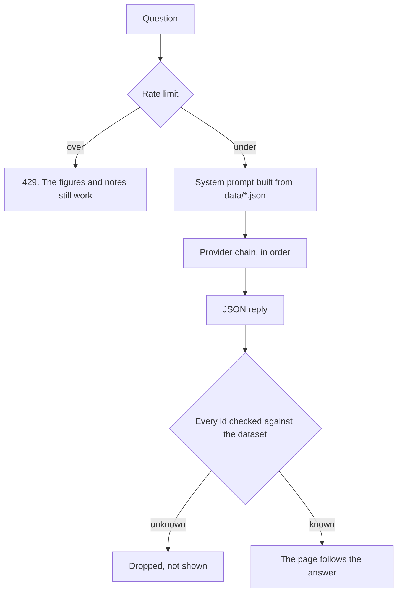

# Priyanshu Yogi

> *Don't read my resume. Talk to it.*

**[priyanshu.fyi](https://priyanshu.fyi)** · A portfolio drawn as an economist's figure sheet, with an agent in the margin that answers only from the data the page itself is rendered from.

Every section is a numbered Figure or Table. Every AI answer derives from six JSON files. When the answer names evidence, the page goes to it.

---

## Table 1 · Where everything comes from

| File | Drives |
|---|---|
| `data/profile.json` | hero, positioning, skills, the six tracks and their evidence, FAQ answers |
| `data/education.json` | the two educations, and the seven turning points plotted as the career curve |
| `data/experience.json` | the roles on the time axis, and the career story |
| `data/projects.json` | the three tiers, and the readTrail, Priyanshu OS and SignalRoom case studies |
| `data/interests.json` | the curiosity scatter and the off-duty panel |
| `data/knowledge.json` | the graph's nodes and links |

Edit the JSON, not the components. The system prompt is rebuilt from the same files on every request, so the page and the agent cannot disagree.[^1]

---

## Fig. 1 · What happens when somebody asks a question



Three things happen in code rather than in the prompt, because a prompt is a request:

- **UI actions are validated** against known section, dimension and project ids before the client runs them. `open_project` is the only action that leaves the page, so it also has to be asked for: at most one, and only when the visitor's own message names that project.
- **Cited evidence is checked.** The job-description fit check drops any match that does not cite a real dataset id, so an uncited claim is never shown.
- **A pasted job description is data, never instructions.** It is wrapped as untrusted input and the prompt refuses to follow anything inside it.

---

## Table 2 · The provider chain

Free tiers fail on their own schedule, and one of them withdrew the model this site ran on. So there are four, tried in order, and a provider that just failed is skipped for five minutes.[^2]

| Slot | Provider | Knowledge base | Note |
|---|---|---|---|
| `LLM_*` | Cerebras | full | usually under a second, and the usual answer |
| `LLM_*_2` | Gemini | full | independent of the rest |
| `LLM_*_3` | OpenRouter | full | many models behind one key |
| `LLM_*_4` | Groq | **lean** | 8k tokens a minute, so it gets a prompt built to fit |

Each attempt has 20 seconds, so a provider that hangs fails over instead of hanging. `npm run bench:providers` races them all against the real dataset and reports latency, success rate and JSON compliance, which is how the order above was chosen. It is the race the router deliberately does not run per request: firing every provider on every visit would drain the daily budgets that make them worth having.

---

## Table 3 · What is rationed

Two public model endpoints on a free-tier key are an open proxy for anyone who finds them.

| Route | Per visitor | Per day, everyone |
|---|---|---|
| `/api/chat` | 5 a minute, 20 a day | 30 |
| `/api/relevance` | 3 a minute, 5 a day | 12 |

---

## Run

```sh
npm install
cp .env.example .env.local   # add LLM_BASE_URL, LLM_MODEL, LLM_API_KEY
npm run dev
```

One provider is enough to start. Add `_2`, `_3`, `_4` for the chain, and `LLM_KB_TIER_n=lean` plus `LLM_MAX_OUTPUT_n` for a provider whose token budget cannot fit the full prompt. Examples are in `.env.example`.

**The site renders completely without a key.** Only the marginalia panel and the fit check need one.

| Script | Does |
|---|---|
| `npm run dev` | development server |
| `npm run build` | production build |
| `npm run typecheck` | `tsc --noEmit`; the JSON is typed, so a shape mistake fails here |
| `npm run bench:providers` | races every configured provider and suggests an order |

---

## What it will not do

The honesty rules are in the data, and the agent is told about them.

- Projects marked `exploring` or `planned` are interest, never experience, and the agent says so.
- readTrail is a working MVP. SignalRoom is a working demo on synthetic data with a published evaluation, including the contradictions its model missed.
- The fit check returns gaps next to the matches. A fit report with no gaps is not trustworthy, so the site argues against its own candidate in writing.
- Nothing in `data/*.json` comes from anywhere but the resume, the project repositories and the GitHub profile.

Known limits, in the same spirit: there is no conversation memory, voice quality is whatever the browser ships, the rate-limit counters live in the running instance so the daily cap is a brake rather than a guarantee, and a free provider can still withdraw a model at any time. The chain turns that into a slower answer instead of an outage. It does not remove it.

---

## Notes

**Stack.** Next.js 15 (App Router), TypeScript, Tailwind v4. A provider-agnostic client speaking the OpenAI-compatible chat format (`lib/ai/llm.ts`), so a provider is three environment variables and no code. Structured JSON for UI actions rather than vendor tool-calling. Web Speech API for voice, browser-native and keyless. d3-force for the graph. Motion for one authored motion grammar.

**Design system.** The world is recorded in [`DESIGN.md`](DESIGN.md) as "the economist's figure sheet": numbered figures, hairline rules, two renditions of one world (`data-theme="sheet"` light, `data-theme="board"` dark, remembered in localStorage). Product truth is in [`PRODUCT.md`](PRODUCT.md). Fonts are self-hosted OFL files. Both documents were produced with the [Impeccable](https://impeccable.style) skill, vendored under `.claude/skills/impeccable`.

**Motion.** One grammar: things are drawn onto the sheet, not dropped in. Fig. 1 draws its axes, then the curve by `pathLength`, then lands its points in order, and rings the first and last, because the span between them is the argument the figure is making. `prefers-reduced-motion` keeps every state change and removes the movement, including programmatic scrolling.

**Keyboard.** `⌘K` or `Ctrl+K` opens the agent, `Escape` closes it. Every figure is reachable by tab, and the points and nodes answer Enter and Space. Typing `/off-duty` anywhere outside a field opens the personal panel.

**How it was built.** Designed and built by Priyanshu Yogi, with Claude doing much of the implementation across Cowork and Claude Code, and the Impeccable skill running the design process: product truth first, a direction round, a written direction contract, an independent finish review, and `DESIGN.md` recorded from the built code afterwards. The commit history reflects the real order of the work, including the outage that produced Table 2. Content decisions, the data model, the honesty rules and the final calls on design were his.

[^1]: The one exception is the note text for Fig. 1, which lives in `components/sections/Hero.tsx`. Changing a turning point means changing both.

[^2]: Written up as a case study at [`/projects/priyanshu-os`](https://priyanshu.fyi/projects/priyanshu-os), including the 4xx classification bug the fix introduced and the sabotage test that caught it.
